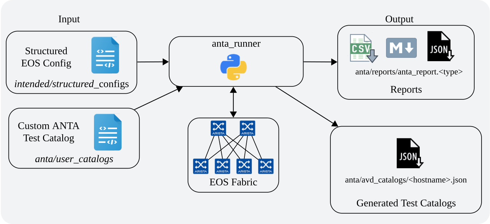

---
# This title is used for search results
title: Ansible Collection Role anta_runner
---
<!--
  ~ Copyright (c) 2024-2025 Arista Networks, Inc.
  ~ Use of this source code is governed by the Apache License 2.0
  ~ that can be found in the LICENSE file.
  -->

# anta_runner

## Overview

**anta_runner** is a role leveraged to validate Arista EOS devices' operational states using the [Arista Network Test Automation (ANTA)](https://anta.arista.com) framework.

By default, the role generates a per-device test catalog based on the AVD structured configurations. It executes the ANTA tests against the devices defined in the Ansible inventory.

It can also be used to execute user-defined ANTA test catalogs in conjunction with the Ansible inventory, providing similar functionality and options as the [ANTA CLI](https://anta.arista.com/stable/cli/overview/) while benefiting from Ansible's inventory management capabilities.

Results are reported in various formats, including JSON, CSV, and Markdown.

## Requirements

Requirements are located in the AVD [installation](../../../../../docs/installation/collection-installation.md#python-requirements-installation) documentation.

## Basic Example

This example will generate a per-device test catalog based on the AVD structured configurations and execute the ANTA tests against all devices in the inventory group `FABRIC`:

```yaml title="playbook.yml"
---
- name: Run ANTA
  hosts: FABRIC # <-- Targeted devices
  connection: local
  gather_facts: false
  tasks:
    - name: Run ANTA on EOS devices
      import_role:
        name: arista.avd.anta_runner
```

The artifacts generated by the role, including results from ANTA, will be stored in the `anta` folder in the inventory directory.

The `Run ANTA on EOS devices` task will fail if any of the following conditions occur:

- **No tests executed:** If no tests were run against any device (and it's not a `dry_run`)
- **Execution errors:** If errors arise during the role execution, originating from Ansible, PyAVD, or ANTA
- **Test failures or errors:** If any ANTA test reports a failure or error status.

!!! tip
    To continue running the playbook when `anta_runner` fails, use Ansible `ignore_errors`. For more details, refer to the [Ansible documentation](https://docs.ansible.com/ansible/latest/playbook_guide/playbooks_error_handling.html).

## Understanding ANTA Catalogs

The `anta_runner` role works with two types of test catalogs:

1. **AVD-generated catalogs:** These are automatically created based on structured configurations. They contain tests tailored to both device-specific configurations and the network design.
2. **User-defined catalogs:** These are custom ANTA test catalogs you can create and provide to the role. They allow you to add any tests that are available in the ANTA framework.

Different filtering mechanisms are used depending on the catalog type, explained in the [Advanced Filtering Options](#advanced-filtering-options) sections.

## Role Inputs and Outputs

Figure 1 below provides a visualization of the role's inputs, outputs executed by the role.



**Inputs:**

- Only the structured configuration files generated by `eos_designs` will be parsed to render test catalogs. Variables from the Ansible inventory will **not** be considered. Any `raw_eos_cli` configuration will also **not** be considered.
- User-defined custom tests may also be defined. For test definitions, please see the test catalog on [anta.arista.com](https://anta.arista.com/stable/api/tests/).

**Outputs:**

- Test reports in either CSV, Markdown, or JSON formats.
- Optional: Saves a copy of the AVD-generated tests per device.

## Role Configuration and Options

By default, this role will generate the AVD-generated catalog and execute the ANTA tests against all hosts targeted by the Ansible "play".

```yaml title="playbook.yml"
---
- name: Run ANTA
  hosts: FABRIC # <-- Targeted devices
  connection: local
  gather_facts: false
  tasks:
    - name: Run ANTA on EOS devices
      import_role:
        name: arista.avd.anta_runner
```

This playbook targets the Ansible inventory group `FABRIC`, so all devices under this group will be targeted for the catalog generation and test execution.

!!! tip
    Only a subset of this group can be tested by supplying the `--limit <hostname or group>,<hostname or group>` flag to the `ansible-playbook` command.

You can also manually supply a list of devices:

```yaml
# Run ANTA for these devices.
# Defaults to all hosts in the play.
# This means the role must be imported/included in a play targeting only the
# relevant EOS devices - *not* CloudVision.
anta_devices: [ DC1-LEAF1A, DC1-LEAF1B ]
```

!!! note
    The device name is used directly to find the EOS structured configuration files.
    This means the device names are case sensitive and must match the file names.

Devices with `is_deployed: false` set as part of `eos_designs` inputs will automatically be ignored.

!!! note
    When devices are excluded from a run, whether by using `--limit` or `anta_devices`, tests that rely on the excluded devices will not be executed. For example, if a test requires information from a device that is not included, the test will be skipped. The same behavior applies to `is_deployed: false` devices.

The role connects to EOS devices via eAPI using HTTP/HTTPS, so the devices must be accessible from the Ansible control node. Even though the role uses ANTA's HTTP client, the Ansible connection variables are used to build the connections and must be set accordingly:

```yaml
# The IP/name of the target host to use instead of inventory_hostname.
ansible_host: <str>

# The user Ansible logs in as.
ansible_user: <str>

# One of the following must be set for the authentication.
ansible_password: <str>
ansible_httpapi_pass: <str>
ansible_httpapi_password: <str>

# Some tests require elevated privileges to run (enable mode).
ansible_become: <bool; default=false>
ansible_become_password: <str>

# eAPI port and SSL verification.
ansible_httpapi_port: <int; default=80 or 443 depending on ansible_httpapi_use_ssl>
ansible_httpapi_use_ssl: <bool; default=true>
```

### Directory Configuration

The EOS device AVD structured configurations are read from files generated by `arista.avd.eos_designs` role.

The directories are configured with the same variables as for the other AVD roles:

```yaml
# Root directory.
root_dir: "{{ inventory_dir }}"

# Main output directory used in AVD.
output_dir_name: "intended"
output_dir: "{{ root_dir }}/{{ output_dir_name }}"

# Output for structured configuration files.
structured_dir_name: "structured_configs"
structured_dir: "{{ output_dir }}/{{ structured_dir_name }}"

# Structured configuration file format. Supported formats: yml, yaml, json.
avd_structured_config_file_format: "yml"
```

The ANTA-related directories for the role are configured as follows:

```yaml
# Main directory for the ANTA-related files.
anta_dir_name: "anta"
anta_dir: "{{ root_dir }}/{{ anta_dir_name }}"

# Directory for ANTA user-defined catalog files. These are the catalogs created by the user.
# The role will search for valid ANTA catalogs in this directory
# and merge them with each device's AVD-generated catalog.
user_catalogs_dir_name: "user_catalogs"
user_catalogs_dir: "{{ anta_dir }}/{{ user_catalogs_dir_name }}"

# Directory for AVD-generated ANTA catalogs. Per-device catalogs will be stored here.
avd_catalogs_dir_name: "avd_catalogs"
avd_catalogs_dir: "{{ anta_dir }}/{{ avd_catalogs_dir_name }}"

# Directory for ANTA reports.
anta_reports_dir_name: "reports"
anta_reports_dir: "{{ anta_dir }}/{{ anta_reports_dir_name }}"

# Paths for the generated reports. Supports JSON, CSV, and Markdown.
anta_report_json_path: "{{ anta_reports_dir }}/anta_report.json"
anta_report_md_path: "{{ anta_reports_dir }}/anta_report.md"
anta_report_csv_path: "{{ anta_reports_dir }}/anta_report.csv"
```

### Additional Role Settings

These settings allow modification of the default behavior as needed. The values below are the default values:

```yaml
# Enable AVD catalogs generation. Can be disabled if only user-defined catalogs are used.
avd_catalogs_enabled: true

# Generate tests for BGP peers in VRFs.
avd_catalogs_allow_bgp_vrfs: false

# Global timeout for the ANTA runner. Depending on the scale this can be adjusted.
anta_runner_timeout: 30

# ANTA runner batch size. This controls the number of devices that will be processed in parallel.
# 5-10 is a good starting point.
anta_runner_batch_size: 5

# Run ANTA in dry-run mode. This will generate the tests but not execute them.
anta_runner_dry_run: false
```

!!! tip
    The role automatically respects the `ansible_forks` setting to determine the maximum number of worker processes in conjunction with `anta_runner_batch_size`. Consider adjusting these settings for a large deployment with many devices to optimize performance while managing resource usage.

### Advanced Filtering Options

Optional filtering mechanisms are available to modify the behavior of the role.

#### Tag-Based Filtering

`anta_runner_tags`: When using user-defined catalogs, tags can be used to filter which tests to run on which devices. These tags are used in conjunction with the `anta_tags` variable assigned to devices in the Ansible inventory.

```yaml
# In the inventory file
all:
  children:
    FABRIC:
      hosts:
        DC1-LEAF1A:
          anta_tags: [ leaf ]  # <-- Tag this device with 'leaf'
        DC1-SPINE1:
          anta_tags: [ spine ] # <-- Tag this device with 'spine'

# In a user-defined catalog
anta.tests.vxlan:
  - VerifyVxlan1Interface:
      filters:
        tags: [ leaf ] # <-- Tag this test with 'leaf'

# In the playbook
- name: Run ANTA
  hosts: FABRIC
  connection: local
  gather_facts: false
  tasks:
    - name: Run ANTA on EOS devices
      import_role:
        name: arista.avd.anta_runner
      vars:
        avd_catalogs_enabled: false  # <-- Disable AVD-generated catalogs to use only user-defined catalogs
        anta_runner_tags: [ leaf ]   # <-- Only run tests tagged with 'leaf' on devices with 'leaf' tag
```

!!! warning
    Tests in the AVD-generated catalogs are tagged with the device's hostname only. This means using `anta_runner_tags` with tags other than any device's hostname will skip all AVD-generated tests. To run/skip tests from the AVD-generated catalogs, use the `avd_catalogs_filters` variable described below.

#### Test-Based Filtering

`avd_catalogs_filters`: Filters are used to run or skip tests from the AVD-generated catalogs. These filters do **not** apply to user-defined catalogs, use `anta_runner_tags` for that. See the [AVD test index](#avd-generated-catalog-test-index) section for the available tests.

```yaml
# In the playbook
- name: Run ANTA
  hosts: FABRIC
  connection: local
  gather_facts: false
  tasks:
    - name: Run ANTA on EOS devices
      import_role:
        name: arista.avd.anta_runner
      vars:
        avd_catalogs_filters:
          # Skip VerifyNTP for all devices targeted by the run
          - skip_tests: [ VerifyNTP ]
          # Skip VerifyReachability for all devices in the DC1 Ansible inventory group
          - device_list: "{{ groups['DC1'] }}"
            skip_tests: [ VerifyReachability ]
          # Only run VerifyLLDPNeighbors for DC2-LEAF1A and DC2-LEAF1B
          - device_list: [ "DC2-LEAF1A", "DC2-LEAF1B" ]
            run_tests: [ VerifyLLDPNeighbors]
```

By default, filters apply to all devices targeted by the run. `device_list` can be used in a filter to target a subset of devices only. Filters are not cumulative for a device. If a device matches multiple filters, the last filter (appearing later in the list) wins independently for both `skip_tests` and `run_tests`.

!!! note
    `skip_tests` takes precedence over `run_tests`. If the same test is in both lists, it will be skipped, and other tests will be run.

#### Report Filtering

`anta_report_hide_statuses`: A list of test result statuses to hide from the generated reports. The available statuses are `success`, `failure`, `error`, `skipped`, and `unset`.

```yaml
# In the playbook
- name: Run ANTA
  hosts: FABRIC
  connection: local
  gather_facts: false
  tasks:
    - name: Run ANTA on EOS devices
      import_role:
        name: arista.avd.anta_runner
      vars:
        anta_report_hide_statuses: [ success, skipped ]
```

## AVD-generated Catalog Test Index

Below are the ANTA tests currently generated by AVD. We focus on integrating tests that are most relevant to AVD-generated designs, so not all tests from the ANTA library will be included.

If you believe a valuable test is missing, please let us know by raising a GitHub issue or submitting a pull request.

The table below shows which parts of the AVD structured configuration are used to generate the inputs for each ANTA test. Tests without a specific configuration source run checks that don't require variable inputs (e.g., checking for coredumps or generic system states).

| Test Class | Description | AVD Configuration Source for Inputs |
| :--- | :--- | :--- |
| [**VerifyAgentLogs**](https://anta.arista.com/stable/api/tests/system/#anta.tests.system.VerifyAgentLogs){:target="_blank"} | Verifies that there are no agent crash reports on the device. | *None* |
| [**VerifyAPIHttpsSSL**](https://anta.arista.com/stable/api/tests/security/#anta.tests.security.VerifyAPIHttpsSSL){:target="_blank"} | Verifies the SSL profile for the eAPI HTTPS server is valid and attached. | `management_api_http.https_ssl_profile` |
| [**VerifyAVTSpecificPath**](https://anta.arista.com/stable/api/tests/avt/#anta.tests.avt.VerifyAVTSpecificPath){:target="_blank"} | Verifies the status of specific AVT paths in the routing table. | <ul><li>`router_adaptive_virtual_topology.vrfs`</li><li>`router_path_selection.path_groups`</li><li>`static_peers`</li></ul> |
| [**VerifyBGPPeerSession**](https://anta.arista.com/stable/api/tests/routing.bgp/#anta.tests.routing.bgp.VerifyBGPPeerSession){:target="_blank"} | Verifies that BGP peer sessions are in an 'established' state. | `router_bgp.neighbors` |
| [**VerifyCoredump**](https://anta.arista.com/stable/api/tests/system/#anta.tests.system.VerifyCoredump){:target="_blank"} | Verifies that there are no coredump files in `/var/core`. | *None* |
| [**VerifyEnvironmentCooling**](https://anta.arista.com/stable/api/tests/hardware/#anta.tests.hardware.VerifyEnvironmentCooling){:target="_blank"} | Verifies the status of all fans and the overall environment cooling. | *None*,  default states=["ok"] |
| [**VerifyEnvironmentPower**](https://anta.arista.com/stable/api/tests/hardware/#anta.tests.hardware.VerifyEnvironmentPower){:target="_blank"} | Verifies the status of all power supply units (PSUs). | *None*,  default states=["ok"] |
| [**VerifyEnvironmentSystemCooling**](https://anta.arista.com/stable/api/tests/hardware/#anta.tests.hardware.VerifyEnvironmentSystemCooling){:target="_blank"} | Verifies the overall system cooling status is 'ok'. | *None* |
| [**VerifyFileSystemUtilization**](https://anta.arista.com/stable/api/tests/system/#anta.tests.system.VerifyFileSystemUtilization){:target="_blank"} | Verifies that no partition is utilizing more than 75% of its disk space. | *None* |
| [**VerifyIllegalLACP**](https://anta.arista.com/stable/api/tests/interfaces/#anta.tests.interfaces.VerifyIllegalLACP){:target="_blank"} | Verifies that no interfaces have received illegal LACP packets. | *None* |
| [**VerifyInterfaceDiscards**](https://anta.arista.com/stable/api/tests/interfaces/#anta.tests.interfaces.VerifyInterfaceDiscards){:target="_blank"} | Verifies that the interfaces packet discard counters are equal to zero. | *None* |
| [**VerifyInterfaceErrDisabled**](https://anta.arista.com/stable/api/tests/interfaces/#anta.tests.interfaces.VerifyInterfaceErrDisabled){:target="_blank"} | Verifies that no interfaces are in an `errdisabled` state. | *None* |
| [**VerifyInterfaceErrors**](https://anta.arista.com/stable/api/tests/interfaces/#anta.tests.interfaces.VerifyInterfaceErrors){:target="_blank"} | Verifies that interface error counters are not increasing. | *None* |
| [**VerifyInterfaceUtilization**](https://anta.arista.com/stable/api/tests/interfaces/#anta.tests.interfaces.VerifyInterfaceUtilization){:target="_blank"} | Verifies that interface utilization is below a defined threshold. | *None* |
| [**VerifyInterfacesStatus**](https://anta.arista.com/stable/api/tests/interfaces/#anta.tests.interfaces.VerifyInterfacesStatus){:target="_blank"} | Verifies the operational status of enabled network interfaces. | <ul><li>`ethernet_interfaces`</li><li>`port_channel_interfaces`</li><li>`vlan_interfaces`</li><li>`loopback_interfaces`</li><li>`dps_interfaces`</li><li>VXLAN interface, if the device is a VTEP</li></ul> |
| [**VerifyLLDPNeighbors**](https://anta.arista.com/stable/api/tests/connectivity/#anta.tests.connectivity.VerifyLLDPNeighbors){:target="_blank"} | Verifies LLDP neighbors for Ethernet interfaces.<br>A test is generated when all are true:<ul><li>peer and peer_interface are defined.</li><li>The peer device is deployed (is_deployed: true).</li><li>The interface is not a subinterface.</li><li>The interface is not shut down on either the local or peer side.</li><li>The test is not disabled by validate_state or validate_lldp.</li></ul> | `ethernet_interfaces` (specifically peer information) |
| [**VerifyLoggingErrors**](https://anta.arista.com/stable/api/tests/logging/#anta.tests.logging.VerifyLoggingErrors){:target="_blank"} | Verifies that there are no new 'error' or higher severity syslog messages. | *None* |
| [**VerifyMaintenance**](https://anta.arista.com/stable/api/tests/system/#anta.tests.system.VerifyMaintenance){:target="_blank"} | Verifies that the device is not currently under or entering maintenance. | *None* |
| [**VerifyMemoryUtilization**](https://anta.arista.com/stable/api/tests/system/#anta.tests.system.VerifyMemoryUtilization){:target="_blank"} | Verifies whether the memory utilization is below 75%. | *None* |
| [**VerifyMlagConfigSanity**](https://anta.arista.com/stable/api/tests/mlag/#anta.tests.mlag.VerifyMlagConfigSanity){:target="_blank"} | Verifies the health and sanity of the MLAG configuration. | `mlag_configuration` |
| [**VerifyMlagInterfaces**](https://anta.arista.com/stable/api/tests/mlag/#anta.tests.mlag.VerifyMlagInterfaces){:target="_blank"} | Verifies there are no inactive or active-partial MLAG ports. | `mlag_configuration` |
| [**VerifyMlagStatus**](https://anta.arista.com/stable/api/tests/mlag/#anta.tests.mlag.VerifyMlagStatus){:target="_blank"} | Verifies the global MLAG state is 'active' and other parameters are consistent. | `mlag_configuration` |
| [**VerifyNTP**](https://anta.arista.com/stable/api/tests/system/#anta.tests.system.VerifyNTP){:target="_blank"} | Verifies that the device's NTP service is synchronized with a time source. | *None* |
| [**VerifyPortChannels**](https://anta.arista.com/stable/api/tests/interfaces/#anta.tests.interfaces.VerifyPortChannels){:target="_blank"} | Verifies the status of Port-Channel interfaces and their members. | `port_channel_interfaces` |
| [**VerifyReachability**](https://anta.arista.com/stable/api/tests/connectivity/#anta.tests.connectivity.VerifyReachability){:target="_blank"} | Point-to-point ethernet links when:<br><ul><li>`peer`, `peer_interface` and `ip_address` are defined</li><li>`ip_address` is static - *not* 'dhcp' and *not* 'unnumbered'</li><li>Interface is not shutdown - considers `shutdown` and `interface_defaults.ethernet.shutdown`</li><li>`peer` device is deployed - `is_deployed=True`</li><li>`peer_interface` on the `peer` device has a defined static `ip_address` - *not* 'dhcp' and *not* 'unnumbered'</li><li>`peer_interface` is not shutdown - considers `shutdown` and `interface_defaults.ethernet.shutdown`</li></ul><br>BGP neighbors when: <br><ul><li>`update_source` IP address is defined</li></ul> | See description |
| [**VerifyReloadCause**](https://anta.arista.com/stable/api/tests/system/#anta.tests.system.VerifyReloadCause){:target="_blank"} | Verifies that the last reload cause was expected. | allowed_causes=["USER", "FPGA", "ZTP"] |
| [**VerifyRoutingProtocolModel**](https://anta.arista.com/stable/api/tests/routing.generic/#anta.tests.routing.generic.VerifyRoutingProtocolModel){:target="_blank"} | Verifies the configured routing protocol model. | `service_routing_protocols_model` |
| [**VerifyRunningConfigDiffs**](https://anta.arista.com/stable/api/tests/configuration/#anta.tests.configuration.VerifyRunningConfigDiffs){:target="_blank"} | Verifies there are no differences between the running and startup configs. | *None* |
| [**VerifySpecificIPSecConn**](https://anta.arista.com/stable/api/tests/security/#anta.tests.security.VerifySpecificIPSecConn){:target="_blank"} | Verifies the status of specific IPSec tunnels. | `router_path_selection` |
| [**VerifySpecificPath**](https://anta.arista.com/stable/api/tests/path_selection/#anta.tests.path_selection.VerifySpecificPath){:target="_blank"} | Verifies the DPS path and telemetry state of an IPv4 peer. | `router_path_selection` |
| [**VerifySTPCounters**](https://anta.arista.com/stable/api/tests/stp/#anta.tests.stp.VerifySTPCounters){:target="_blank"} | Verifies there is no errors in STP BPDU packets. | *None* |
| [**VerifyStormControlDrops**](https://anta.arista.com/stable/api/tests/interfaces/#anta.tests.interfaces.VerifyStormControlDrops){:target="_blank"} | Verifies that no interfaces are dropping packets due to storm-control. | *None* |
| [**VerifyTemperature**](https://anta.arista.com/stable/api/tests/hardware/#anta.tests.hardware.VerifyTemperature){:target="_blank"} | Verifies that all device temperature sensors are within their alert thresholds. | *None* |
| [**VerifyTransceiversTemperature**](https://anta.arista.com/stable/api/tests/hardware/#anta.tests.hardware.VerifyTransceiversTemperature){:target="_blank"} | Verifies that all transceiver temperature sensors are within their alert thresholds. | *None* |
| [**VerifyVxlanConfigSanity**](https://anta.arista.com/stable/api/tests/vxlan/#anta.tests.vxlan.VerifyVxlanConfigSanity){:target="_blank"} | Verifies the health and sanity of the VXLAN configuration. | `vxlan_interface.vxlan1.vxlan` |
| [**VerifyZeroTouch**](https://anta.arista.com/stable/api/tests/configuration/#anta.tests.configuration.VerifyZeroTouch){:target="_blank"} | Verifies that the Zero Touch Provisioning (ZTP) process is not active. | *None* |

## Logging and Troubleshooting

This section details how to control log verbosity, understand log output, and diagnose common issues for the `anta_runner` role.

### Controlling Log Verbosity

The `anta_runner` role uses Ansible standard verbosity flags (`-v`, `-vv`, etc.) to control log output from its various components, including PyAVD, ANTA, underlying libraries, and the `anta_workflow` action plugin. Adjust the verbosity level using the `ansible-playbook` command:

```bash
ansible-playbook playbooks/anta-runner.yml -vvv
```

!!! tip
    Running `ansible-playbook` with `-vvv` is particularly helpful to troubleshoot why some specific AVD-generated tests are missing from a device's final catalog. PyAVD will output detailed information about skipped tests and the reasons for their exclusion.

### Understanding Log Output

`anta_runner` processes devices in parallel batches for improved performance. To help correlate log messages to specific operations or device batches, each log entry is prefixed with a unique identifier:

- `anta-workflow`: Indicates logs from the main Ansible action plugin process.
- `anta-run-xxxxxxxx`: Indicates logs from a specific ANTA execution run handling a batch of devices.

These prefixes are essential when debugging issues related to a particular device or test batch.

### Managing Log Files

Console logs adhere to standard Ansible logging configurations. For persistent storage and easier analysis, especially when using high verbosity, consider configuring `log_path` in your `ansible.cfg` file to redirect the primary output stream to the specified log file. For more details, refer to the [Ansible documentation](https://docs.ansible.com/ansible/latest/reference_appendices/logging.html).

## License

Project is published under [Apache 2.0 License](https://github.com/aristanetworks/avd/blob/devel/LICENSE).

## Known Issues

- `[__NSCFConstantString initialize] may have been in progress in another thread when fork() was called.` This issue affects OSX users only and is covered in Ansible documentation: https://docs.ansible.com/ansible/latest/reference_appendices/faq.html#running-on-macos-as-a-control-node.
