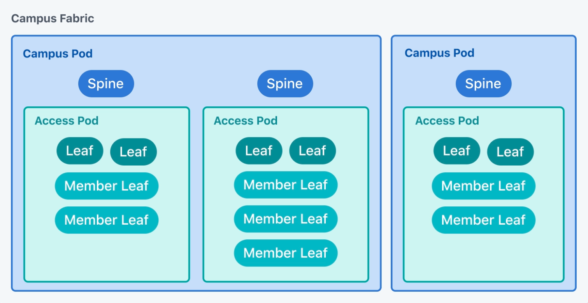

---
# This title is used for search results
title: Generate Cloudvision Tags with eos_designs
---
<!--
  ~ Copyright (c) 2023-2025 Arista Networks, Inc.
  ~ Use of this source code is governed by the Apache License 2.0
  ~ that can be found in the LICENSE file.
  -->

# Generate CloudVision Tags

`arista.avd.eos_designs` can generate CloudVision Tags that can be applied to interfaces and/or devices. These tags can be used on CloudVision for during Topology view generation,
or used in searches/filters to select devices based on tags values.

## Available Input Variables

--8<--
ansible_collections/arista/avd/roles/eos_designs/docs/tables/cloudvision-tags.md
--8<--

## CloudVision Topology Tags

`arista.avd.eos_designs` can generate CloudVision Tags that assist CloudVision with rendering the Topology correctly.
It will attempt to generate what are called 'hints' for the following fields. These are picked up from the fabric variables if they are defined.

To enable generation of Topology Tags:

```yaml
generate_cv_tags:
  topology_hints: true
```

| Hint Tag Name | Description | Source of information |
| ------------- | ----------- | --------------------- |
| `topology_hint_type` | Indicates whether the node is a leaf, spine, core device etc. | `cv_tags_topology_type` if set, else `node_type_keys.[].cv_tags_topology_type`. |
| `topology_hint_fabric` | The overall fabric that the devices pertains to. Useful for multi-fabric deployments. | `fabric_name` |
| `topology_hint_datacenter` | The datacenter to which the devices belongs. Helpful for multi-dc deployments. | `dc_name` |
| `topology_hint_pod` | The pod to which the devices belongs. | `pod_name` |
| `topology_hint_rack` | The physical rack in which the device is located. | `rack` defined on `node` or `node_group` |

## PREVIEW: CloudVision Tags for Campus deployments

!!! warning

    The generation of CloudVision Tags for Campus deployments in the `eos_designs` role is in preview mode.

    Everything is subject to change, is not supported and may not be complete.

    If you have any questions, please leverage the GitHub [discussions board](https://github.com/aristanetworks/avd/discussions)

`arista.avd.eos_designs` can generate CloudVision Tags that assist CloudVision with rendering the Campus Topologies (supported on CloudVision as a Service (CVaaS) or "on-prem" CloudVision 2024.3.0 or later).
This specific use case is required to support Hybrid workflow of managing Campus fabrics with both AVD and CloudVision Studios where:

- AVD is leveraged to build the fabric, deploy network services and infrastructure-related endpoints (firewalls, routers, access points, etc.).
- Access Interface Configuration Studio (including it's Quick Actions sub-feature) is leveraged for day-2 operations to configure port profiles and ports using CloudVision UI.

Both `generate_cv_tags.topology_hints` an `generate_cv_tags.campus_fabric` must be set to `true` to globally enable generation of the Campus Topology tags:

```yaml
generate_cv_tags:
  topology_hints: true
  campus_fabric: true
```

Once the generation of Campus Topology tags is globally enabled, assign the following variables - either as native Ansible variables or as part of the `<node_type_keys.key>` or `node_type_keys` AVD data constructs (the latter only applicable to the `cv_tags_topology_type` variable) - to all targeted Campus devices:

- `campus`
- `campus_pod`
- `campus_access_pod` (should not be assigned to Spines)
- `cv_tags_topology_type` (valid values for Campus deployments: `spine`, `leaf` or `member-leaf`)



!!! note
    Please note that generating Campus-related tags for a specific device disables the generation of DC-related tags for that device.

Example (only relevant configuration is shown):

```yaml
# Spine Switches
l3spine:
  defaults:
    campus: AVD_CAMPUS
    campus_pod: BUILDING_A

# IDF - Leaf Switches
l2leaf:
  defaults:
    campus: AVD_CAMPUS
    campus_pod: BUILDING_A
  node_groups:
    - group: IDF1
      campus_access_pod: IDF1
      nodes:
        - name: LEAF1A
        - name: LEAF1B
    - group: IDF3_AGG
      nodes:
        - name: LEAF3A
          campus_access_pod: IDF3
        - name: LEAF3B
          campus_access_pod: IDF3
    - group: IDF3_3C
      campus_access_pod: IDF3
      cv_tags_topology_type: "member-leaf"
```

Note that for standard Arista Universal Cloud Network designs (`L3LS`, `L2LS` and `L2 Only`) it is not mandatory to explicitly specify `cv_tags_topology_type` value for Campus `Spine` and Campus `Leaf` devices, as correct Campus-related `cv_tags_topology_type` values will be derived from the default values of the mapped `node_type_keys`:

| Node Type Key | Default cv_tags_topology_type |
| ------------- | ----------------------------- |
| spine | spine |
| l3spine | spine |
| leaf | leaf |
| l2leaf | leaf |
| l3leaf | leaf |

`cv_tags_topology_type` must be explicitly set for all Campus `Member-Leaf` devices.

Providing these input variables will lead to the automatic generation of the following Campus-related CloudVision Tags:

| Campus Tag Name | Tag type | Description | Source of information |
| --------------- | -------- | ----------- | --------------------- |
| `topology_hint_network_type`| Device | Identifies associated CloudVision Topology hierarchy type. | Always set to `campusV2`. |
| `topology_hint_type` | Device | Identifies role of the device in CloudVision Campus Topology. | `<node_type_keys.key>.nodes.[].cv_tags_topology_type`, else `<node_type_keys.key>.node_groups.[].nodes.[].cv_tags_topology_type`, else `<node_type_keys.key>.node_groups.[].cv_tags_topology_type`, else `<node_type_keys.key>.defaults.cv_tags_topology_type`, else `cv_tags_topology_type`, else `custom_node_type_keys.[].cv_tags_topology_type`, else `node_type_keys.[].cv_tags_topology_type`. |
| `Role` | Device | Identifies role of the device in CloudVision Campus Topology. Used in CV Dashboards. | `<node_type_keys.key>.nodes.[].cv_tags_topology_type`, else `<node_type_keys.key>.node_groups.[].nodes.[].cv_tags_topology_type`, else `<node_type_keys.key>.node_groups.[].cv_tags_topology_type`, else `<node_type_keys.key>.defaults.cv_tags_topology_type`, else `cv_tags_topology_type`, else `custom_node_type_keys.[].cv_tags_topology_type`, else `node_type_keys.[].cv_tags_topology_type`. |
| `Campus` | Device | Identifies Campus fabric. | `<node_type_keys.key>.nodes.[].campus`, else `<node_type_keys.key>.node_groups.[].nodes.[].campus`, else `<node_type_keys.key>.node_groups.[].campus`, else `<node_type_keys.key>.defaults.campus`, else `campus`. |
| `Campus-Pod` | Device | Identifies Campus pod (spine devices and associated access pods). | `<node_type_keys.key>.nodes.[].campus_pod`, else `<node_type_keys.key>.node_groups.[].nodes.[].campus_pod`, else `<node_type_keys.key>.node_groups.[].campus_pod`, else `<node_type_keys.key>.defaults.campus_pod`, else `campus_pod`. |
| `Access-Pod` | Device | Identifies Campus access pod (Leaf and Member-Leaf devices). | `<node_type_keys.key>.nodes.[].campus_access_pod`, else `<node_type_keys.key>.node_groups.[].nodes.[].campus_access_pod`, else `<node_type_keys.key>.node_groups.[].campus_access_pod`, else `<node_type_keys.key>.defaults.campus_access_pod`, else `campus_access_pod`. |
| `Link-Type` | Interface | Identifies system responsible for managing interface (AVD/Studio) and it's purpose (fabric/edge/endpoint/etc.). | `ethernet_interfaces.[].peer_type`. |

!!! warning
    If `cv_deploy` is targeting Campus devices that are not yet registered with CloudVision `Inventory and Topology` studio - `cv_deploy` will currently register those devices skipping their `Model` and `Interfaces`. This will by default not allow `Quick Actions` feature of the `Access Interface Configuration` CloudVision Studio to manage such devices until all `Network Updates` related to these devices are `Accepted` in CloudVision UI.
    This limitation will be addressed in AVD once CloudVision 2025.2.1 is released. After this release, automatic registration of new devices by `cv_deploy` in CloudVision `Inventory and Topology` studio will automatically include `Model` and `Interfaces`.

### CloudVision Campus Dashboard and Campus egress interfaces

The CloudVision Campus Dashboard provides an overview of the Campus network state including bandwidth utilization of the fabric's egress interfaces.


The Dashboard identifies a fabric's egress interfaces by the presence of the `Link-Type: Egress` interface-level tag.
A new key, `campus_link_type`, has been added to the `core_interfaces`, `l3_edge`, `network_ports`, `connected_endpoints`, and `l3_interfaces` (under Network services) data models to provide a flexible way to add new interface-level `Link-Type` tags with an arbitrary value to the fabric interface(s) of your choice.
Set `campus_link_type` to `["Egress"]` for any Fabric interfaces that should be treated as Egress interfaces in the Campus dashboard.

## CloudVision Custom Tags

Custom Tags can have either a static or a dynamic value. Dynamic values come from the `structured_config` generated by `eos_designs`.

Any value that is **not**:

- a list
- a dictionary
- a value in a list

can be defined as the value for a tag. This allows for tags to be generated with values that are calculated for that device. Refer to the example below.

For interfaces, only the `structured_config` for the interface itself is considered.

!!! tip
    Generate the `structured_config` first to get a better idea of which keys are available.

!!! warning
    - Tag names cannot have the name of any existing system tags on CloudVision. System tags cannot be amended with this approach.
    - If the key specified in `data_path` is not found, the tag is not generated. This avoids having a lot of empty tags.
    - Custom structured configuration will *not* be considered during generation of tags. Only configuration generated by `eos_designs` itself.

To generate custom Tags with a static value:

```yaml
generate_cv_tags:
  device_tags:
    - name: mytag
      value: myvalue
  interface_tags:
    - name: myinterfacetag
      value: myinterfacevalue
```

To generate custom Tags with a dynamic value:

```yaml
generate_cv_tags:
  device_tags:
    - name: mydynamictag
      data_path: router_bgp.as
  interface_tags:
    - name: myinterfacetag
      data_path: peer_type
```
