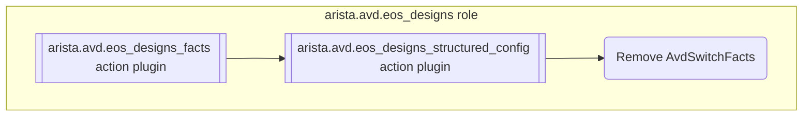
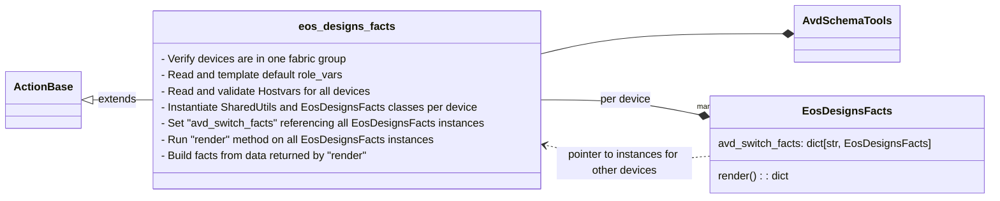
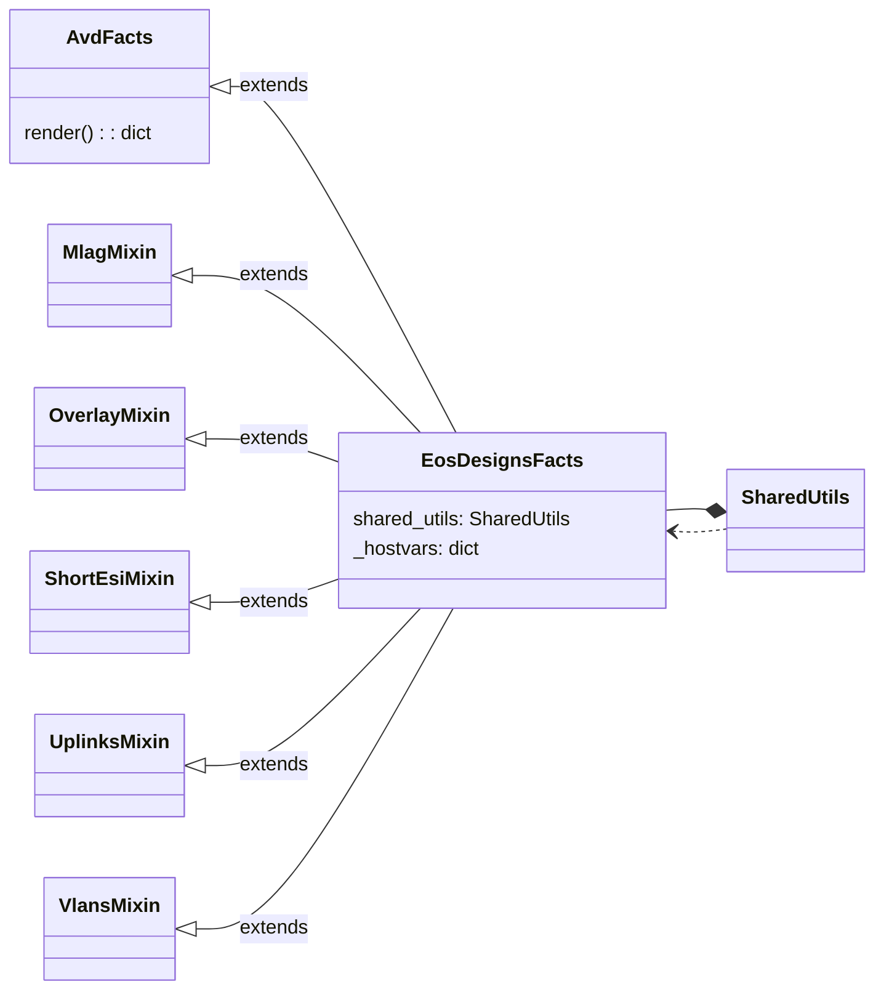
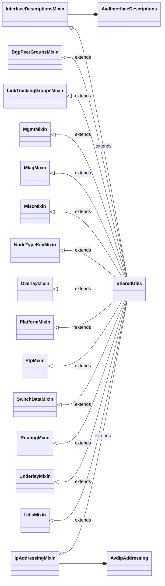
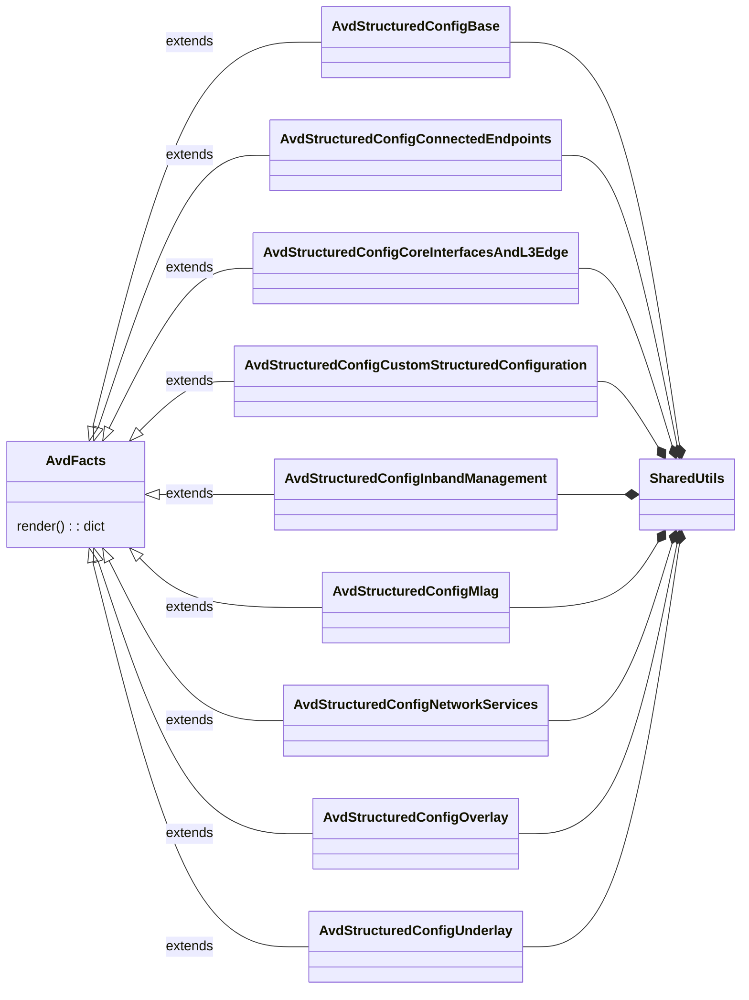

<!--
  ~ Copyright (c) 2023-2025 Arista Networks, Inc.
  ~ Use of this source code is governed by the Apache License 2.0
  ~ that can be found in the LICENSE file.
  -->

# EOS Designs internal notes

!!! Warning

    Anything mentioned here is subject to change without notice. Use of `avd_switch_facts` in custom templates is not supported and should be avoided.

## Overview



## Ansible Action Plugins

### `arista.avd.eos_designs_facts`

The `arista.avd.eos_designs_facts` module is an Ansible Action Plugin providing the following capabilities:

- Set `avd_switch_facts` fact containing  internal AVD facts per switch.

The plugin is designed to `run_once`. With this, Ansible will set the same facts on all devices, so all devices can lookup values of any other device without using the slower `hostvars`.

The module is used in `arista.avd.eos_designs` to set facts for devices, which are then used by Python modules loaded in `arista.avd.eos_designs_structured_config` to generate the `structured_configuration`.

#### Arguments

```yaml
  template_output: <true | false | default -> false>
  validation_mode: <"error" | "warning" | default -> "error">
  cprofile_file: <Filename for storing cprofile data used to debug performance issues>
```

See the full argument spec [here](../plugins/Modules_and_action_plugins/eos_designs_facts.md)

#### Output data model

```yaml
ansible_facts:
  avd_switch_facts:
    <switch_1>: < dict with internal AVD facts used within eos_designs >
    <switch_2>: ...
```

The facts for each device follows the schema described [here](./eos_designs_facts_internal/tables/eos_designs_facts.md).

The facts can be inspected in a file per device by running the `arista.avd.eos_designs` role with `-e avd_eos_designs_debug="{{ true }}"`.

#### Internal structure



### `arista.avd.eos_designs_structured_config`

TODO

## Python packages

### AvdFacts

The `AvdFacts` class serve as a base class for `EosDesignsFacts` as well as the many `AvdStructuredConfig*` classes.

The purpose of `AvdFacts` subclasses is to return a dictionary when the `render` method is called.

The class is also partially emulating a `dict` type by exposing `keys()` and `get()` methods and exposing all public attributes
as `cached_property`. This allows for a class instance to be used as part of a deeper data model, where our utility tools
can traverse deeper data models using dot-notation. It also allows for partial rendering of data, since only the accessed
attributes/cached_properties will be rendered.

The base class has a few important methods:

- `keys()` return a list of attributes not beginning with an underscore and where the attribute is decorated with `cached_property`.
  These attributes represent the keys in the emulated dict.
- `render()` loop over every attribute returned by `keys()` and return a dict with all the returned `cached_properties`, except
  `cached_property` with a value of `None` which will be skipped.
- `get(key, default=None)` returns the value of the requested "key" (`cached_property`) if the "key" is in the list returned by `keys()`.
  Otherwise the default value is returned.

See the source code [here](https://github.com/aristanetworks/avd/tree/devel/python-avd/pyavd/_eos_designs/avdfacts.py)

### get_structured_config

TODO

### EosDesignsFacts

`EosDesignsFacts` is based on `AvdFacts`, so make sure to read the description there first.

The class is instantiated once per device. Methods may use references to other device instances using `hostvars.avd_switch_facts`,
which is a dict of `EosDesignsfacts` instances covering all devices.

See the source code [here](https://github.com/aristanetworks/avd/tree/devel/python-avd/pyavd/_eos_designs/eos_designs_facts)



### SharedUtils

See the source code [here](https://github.com/aristanetworks/avd/tree/devel/python-avd/pyavd/_eos_designs/shared_utils)



### AvdStructuredConfig*

`AvdStructuredConfig*` classes are based on `AvdFacts`, so make sure to read the description there first.

The generation of the final `structured_config` is split into multiple python modules which are subclasses of `AvdFacts`.
Each class is loaded in `get_structured_config` and rendered. All the results are deepmerged into the final `structured_config`.

The class is instantiated once per device. Methods may use references to other device instances using `hostvars.avd_switch_facts`,
which at the time where `eos_designs_structured_config` run, is a nested `dict`. It contains the output from `EosDesignsFacts`'s `render()` method.

Subclasses are typically using Mixin classes to split all the attributes/`cached_properties` into manageable files.

See the source code [here](https://github.com/aristanetworks/avd/tree/devel/python-avd/pyavd/_eos_designs/structured_config)



## Facts set at runtime

### avd_switch_facts

The following model is set as `eos_designs_facts`. Most keys are optional depending on the
use case and configuration.

--8<--
./eos_designs_facts_internal/tables/eos_designs_facts.md
--8<--
