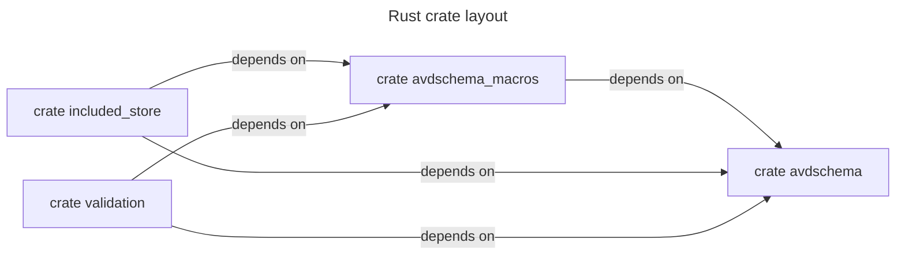

<!--
  ~ Copyright (c) 2025 Arista Networks, Inc.
  ~ Use of this source code is governed by the Apache License 2.0
  ~ that can be found in the LICENSE file.
  -->

> [!WARNING]
> This code is work-in-progress and is not currently being used by AVD.

